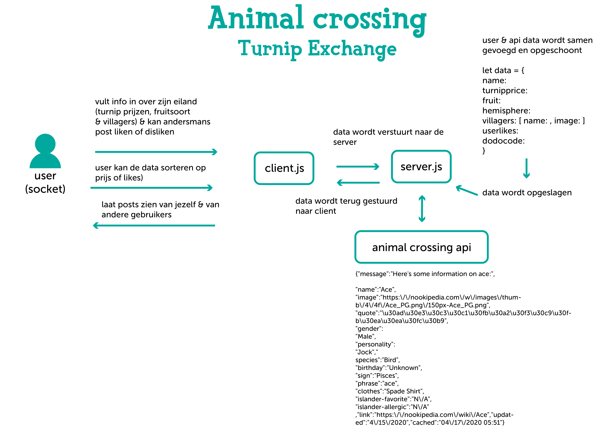

# Real-Time Web @cmda-minor-web · 2019-2020

[demo link](https://monikaas-real-time-web.herokuapp.com/)

## chat app

### animal crossing turnip exchange


(life cycle moet nog worden aangepast)

### install

clone the repo:

```
git clone https://github.com/MonikaaS/real-time-web-1920.git
```

navigate to the repo

```
cd real-time-web-1920
```

install

```
npm install
```

run

```
npm run dev [to run nodemon]
or
npm start
```