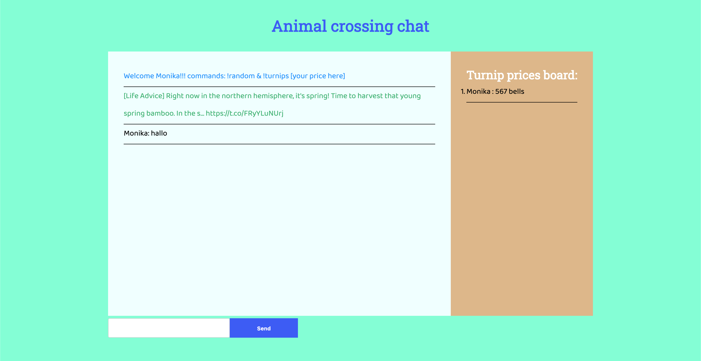

# Real-Time Web @cmda-minor-web · 2019-2020

## chat app

### animal crossing chat


### install

clone the repo:
`git clone https://github.com/MonikaaS/real-time-web-1920.git`

navigate to the repo
`cd real-time-web-1920`

install
`npm install`

run
```
npm run dev [to run nodemon]
or
npm start
```

### features

- add your turnip value to the board
- search for a random advice tweet from the animal crossing twitter

### tech

**client :**
- fill in your username
- chat messages
- chat commands

**server :**
- message: welcome message!
- message: a person joined the chat
- message: user left the chat