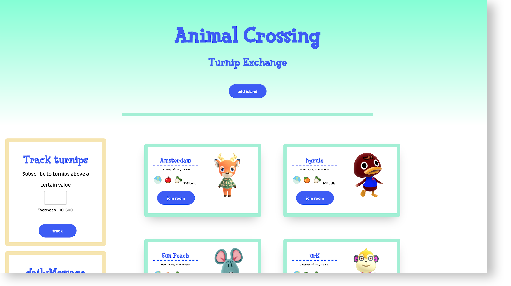
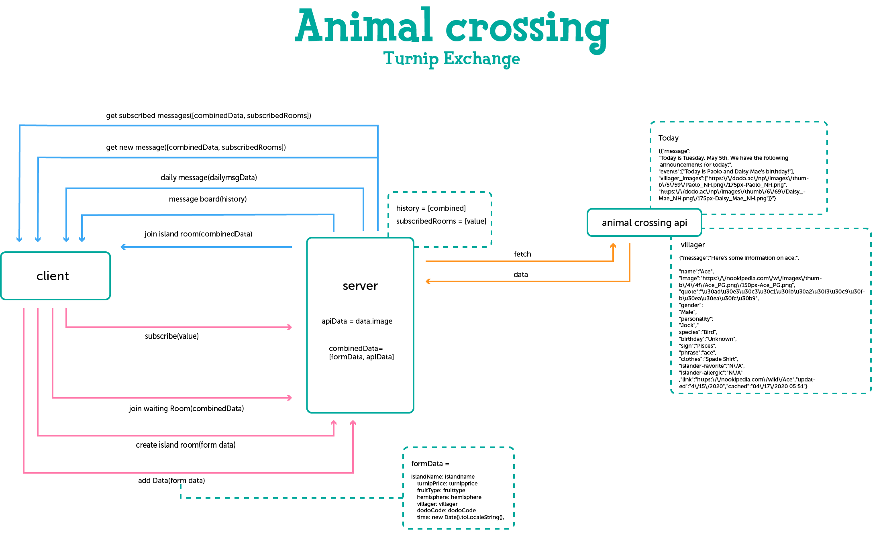

# Real-Time Web @cmda-minor-web · 2019-2020

## [demo link](https://acnh-turnip-exchange.herokuapp.com/)

## animal crossing turnip exchange

application where users can share their daily [turnip](https://www.gamesradar.com/animal-crossing-new-horizons-turnips/) prices from Animal crossing new horizons. Users who are looking to sell their turnips for a good price can join a waiting room to queue up to visit an island.



## installation

clone the repo:

```
git clone https://github.com/MonikaaS/real-time-web-1920.git
```

navigate to the repo

```
cd real-time-web-1920
```

install

```
npm install
```

run

```
npm run dev [to run nodemon]
or
npm start
```

## API

#### [Nookipedia](https://nookipedia.com/api/)

Nookipedia is a private API that holds all kinds of information about animal crossing.

It's made by a small community of animal crossing enthiousiast. Because of the hype for the game, they're not accepting new applications for a key at the moment. (so I got really lucky!!)

example of how the API is used:
`https://nookipedia.com/api/endpoint/parameter/?api_key=KEY`

API endpoints that I used:

- `today` (shows a daily message)
- `villager` ( + a villager name which is required as a parameter)

example data if you request `today`

```
{{"message":
"Today is Tuesday, May 5th. We have the following announcements for today:",
"events":["Today is Paolo and Daisy Mae's birthday!"],
"villager_images":["https:\/\/dodo.ac\/np\/images\/thumb\/5\/59\/Paolo_NH.png\/175px-Paolo_NH.png","https:\/\/dodo.ac\/np\/images\/thumb\/6\/69\/Daisy_Mae_NH.png\/175px-Daisy_Mae_NH.png"]}"}
```

example data if you request a `villager`

```
{"message":
"Here's some information on Apollo:","name":"Apollo","image":"https:\/\/dodo.ac\/np\/images\/thumb\/2\/28\/Apollo_NH.png\/175px-Apollo_NH.png",
"quote":"What goes up must come down.I'm not bald! I've just got fine feathers, that's all!\u80fd\u3042\u308b\u9df9\u306f\u722a\u3092\u96a0\u3059",
"gender":"Male",
"personality":"Cranky",
"species":"Eagle",
"birthday":"July 4th",
"sign":"Cancer",
"phrase":"pah",
"clothes":"Zipper Shirt",
"islander-favorite":"N\/A",
"islander-allergic":"N\/A",
"picture":"https:\/\/dodo.ac\/np\/images\/c\/cb\/ApolloPicACNL.png",
"siblings":"Eldest quintuplet",
"skill":"Staying up late",
"goal":"Pilot","fear":"Ghosts",
"favclothing":"Rock 'n' Roll",
"leastfavclothing":"Basic",
"favcolor":"White",
"coffee-type":"Kilimanjaro",
"coffee-milk":"A little milk",
"coffee-sugar":"One spoonful",
"link":"https:\/\/nookipedia.com\/wiki\/Apollo","updated":"4\/28\/2020","cached":"05\/5\/2020 16:09","api-cache-expire":"2020-05-05 20:09:44"}
```

#### rate limit

there's no mention about a ratelimit, but that doesn't mean you should go crazy with your API calls 😅

## Data life cycle


(life cycle moet nog worden aangepast)

## features

- add your island and turnip prices in one message
- join an island waiting room and queue up to get shown a code to visit in game (at the moment only 2 people in a room can see the code)
- track turnip prices of values you are interested in

## real time events

#### client events

- `add data`
  user adds fills in their island info and submits, api gets called. Form data & api data get's combined. The combined data get's shown to the user and pushed in to an array.

- `subscribe data:`
  user subscribes to a turnip value and get shown only message above a certain value

- `island room code:`
  When a user adds their data, they get automatically put in the room of their island. Now they have to wait on users to join.

- `join waiting room`
  If an island room is full (3 users or more), the user gets put into a waiting room

- `leave room:`
  User leaves the room

#### server events

- `daily message:`
  On connection the user get shown a daily message
- `turnip message:`
  when a user adds data, it get's cleaned up on the server and then send to the client as a message
- `island room code:`
  If there's less than 4 people in the room, a user from the waiting room gets pushed into this one and leaves the other

- `turnip board:`
  Shows cached messages on connection

## to do/Whislist

- [x] Cache incoming messages & rooms on the server
- [x] show messages
- [x] api implementation
- [ ] users can add their 6 villagers living on their island
- [x] waiting rooms and get queued to the code
- [ ] implementation where the creator can choose how many users at a time can join their room (currently it's 2)
- [ ] user roles [seller, buyer etc] and give them their own rights
- [x] subscribe on turnip price
- [ ] database implementation
- [ ] opvote system, so that users can know if someone is legit or not
- [ ] fix bug where last person leaves room and at the exact moment a person from the queue can join the room, crashes the server
- [ ] show in waiting room how many people are in the queue in front of them

### tech

- socket.io
- nodefetch
- nodemon
- .env
